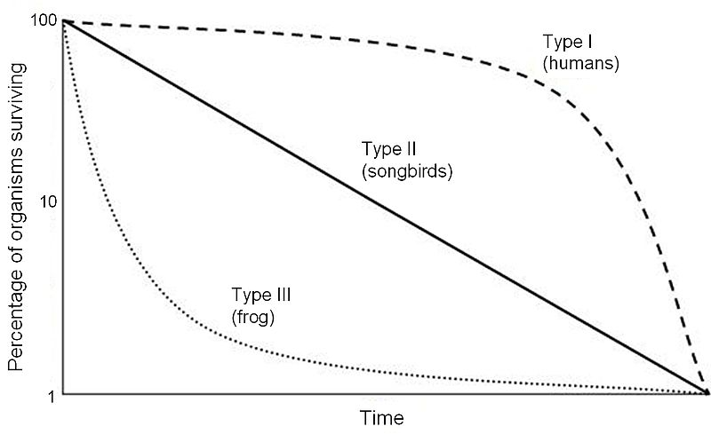

<style type="text/css">
.remark-slide-content {
    font-size: 24px;
    padding: 1em 4em 1em 4em;
}
</style>

```{r setup, echo=FALSE, message=FALSE}
knitr::opts_chunk$set(echo = TRUE, warning = FALSE, error = TRUE)
library("tidyverse")
library("patchwork")
library(broom)
library(glue)
library(ggbeeswarm)
library(lme4)
library(patchwork)
theme_set(theme_bw(base_size = 18))
data(penguins, package = "palmerpenguins")
#options(dplyr.print_min = 2, dplyr.print_max = 3, digits = 4)
```

```{r xaringanExtra-clipboard, echo=FALSE}
xaringanExtra::use_clipboard()
```

```{r share-again, echo = FALSE}
xaringanExtra::use_share_again()
xaringanExtra::use_scribble()
```

# Survival analysis

How long (or far) until an event happens

- How long before a seed germinates
- How long before a patient dies after diagnosis
- How many jumps can a horse clear at a racecourse

Data are typically right censored.

`survival` package

---
## Survival data

Response data 

- time
- status (0/1, TRUE/FALSE)

```{r data}
library(survival)
data(lung)
lung |> slice(1:10)
```

---
## Survival response

+ indicates censored data

```{r, eval = FALSE}
Surv(lung$time, lung$status)
```

```{r, echo = FALSE}
Surv(lung$time, lung$status)[1:30]
```

---
## Fitting a model


```{r}

lung <- lung |> 
  mutate(sex = factor(sex, levels = 1:2, labels = c("male", "female")))
mod_surv <- survfit(Surv(time, status) ~ sex, data = lung)

mod_surv
```

---
## plotting a model

- Kaplan-Meier curve
- '+' mark censored data

```{r survival-plot, fig.height = 5}
library(ggfortify)
autoplot(mod_surv)
```

---
## Testing a model

 - logrank (Mantel-Cox) test 

```{r}
mod_diff <- survdiff(Surv(time, status) ~ sex, data = lung)
mod_diff
```

---
# Survivorship curve

Shape of the survival curve


```{r survivorship-curves, echo = FALSE, out.height="60%"}

```


---
# Hazard: The instantaneous risk of death

```{r}
m_ll <- survreg(Surv(time, status) ~ age + sex, 
                data = lung,
                dist = "loglogistic")
summary(m_ll)
```

---

Exponentiated coefficients show relative increase or decrease in the expected survival times when a covariate is increased one step while others are fixed:

```{r}

exp(coef(m_ll))
```

Expected survival time decreases by 1.4 % (i.e. multiply by 0.986) for each additional year of age

The expected survival time for females is 61.2 % higher than for males (multiply by 1.612).


---

scale 

```{r}
m_ll$scale
```


The scale parameter < 1, indicates that slope of the
hazard decreases with time -  Type III


---
# Summary

## Most important things

1. Designing an experiment
1. R tips and tricks
1. Entering data into a spreadsheet
1. Importing data
1. Cleaning data
1. Data visualisation
1. Using R markdown
1. Choosing a model type
1. Interpreting model output

```{r xaringan-editable, echo=FALSE}
xaringanExtra::use_editable(expires = 1)
```

---
## Designing an experiment

.can-edit[
- 
]

---
## R tips and tricks

.can-edit[
- 
]

---
## Entering data into a spreadsheet

.can-edit[
- 
]


---
## Importing data

.can-edit[
- 
]


---
## Cleaning data


.can-edit[
- 
]

---
## Data visualisation

.can-edit[
- 
]

---
## Using R markdown

.can-edit[
- 
]

---
## Choosing a model

.can-edit[
- 
]

---
## Interpreting model output

.can-edit[
- 
]

---
# Method choice - 2 key questions

Are the data clustered/grouped?

What is the distribution of the residuals?

(also other types of model - survival etc)

---
## Clustered data

Mixed effect models

- Normal distribution:  linear mixed effect models
- Binomial/poisson: generalised linear mixed effect models

---
## Independent data, normal distribution

Linear models - ordinary least squares

- t-tests
 - two sample t-test
 - one sample t-test
 - paired t-test
- lm


---
## Independent data, non-normal distribution

generalised linear models 

- glm

Binomial & Poisson distributions

---
## Interpreting model output


```{r}
data(penguins, package = "palmerpenguins")
mod <- lm(bill_length_mm ~ sex * species, data = penguins)
summary(mod)
```

---
# More statistics at BIO

Bio302 - more regression methods

Bio303 - multivatiate methods


