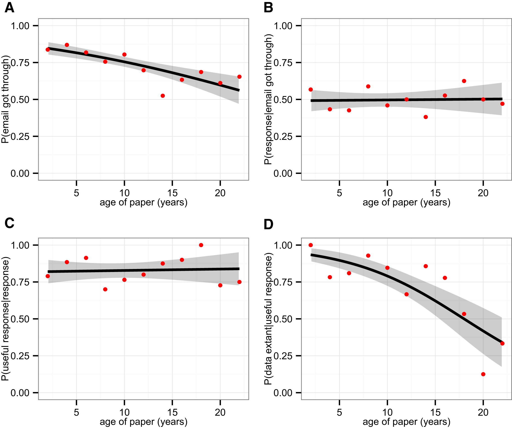
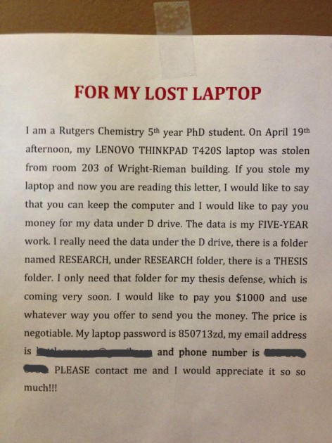
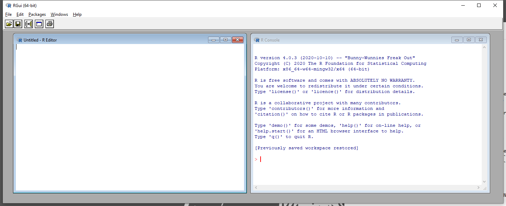

<style type="text/css">
.remark-slide-content {
    font-size: 24px;
    padding: 1em 4em 1em 4em;
}
</style>

```{r share-again, echo = FALSE}
xaringanExtra::use_share_again()
```

## Who I am

 - Palaeoecologist/ecologist with numerical interests
 - R user since 2002
 
 - Interested in
    - Reconstructing environmental change
    - Effect of climate change on ecosystems
    - Reproducibility in science

email: richard.telford@uib.no

---
# Practicalities

- Lectures
  - zoom until korona rules change
  - recorded
  - slides https://biostats-r.github.io/bio300B/
- Practicals
  - 4 sessions per week
  - R books https://biostats-r.github.io/biostats/
  - Interactive tutorials https://github.com/biostats-r/biostats.tutorials
- Software
  - R version >= 4.1
  - Recent RStudio
  - `tidyverse` and `bookdown` packages


---
# Why do biologists need statistics anyway?

```{r xaringan-editable, echo=FALSE}
xaringanExtra::use_editable(expires = 1)
```

.can-edit[
- 
]

---
# Biology is applied data science!

 - Nearly all papers include data visualisation and analysis
 - Need to be able to understand the methods used to evaluate paper
 - Need to be able to make visualisations and analyses for papers, reports, theses

---
# Changing expectations

- FAIR and open science
- Reproducible research

[Most scientists 'can't replicate studies by their peers'](http://www.bbc.com/news/science-environment-39054778)

---
# Data life-cycle

``` {r setup, include=FALSE}
knitr::opts_chunk$set(echo = FALSE, warning = FALSE, error = TRUE)
library("tidyverse")
data(penguins, package = 'palmerpenguins')
options(tibble.print_min = 3)
```


```{r data-life-cycle}
library(DiagrammeR)
grViz("
      digraph circo {
      
      graph [layout = dot,  rankdir = TB]
      
      node [shape = egg, fontsize = 18, style = filled, fillcolor =  steelblue1, fixedsize = FALSE, fontname = 'Palatino']
      a [label = 'Design']
      b [label = 'Gather', fillcolor = grey]
      b2 [label = 'Enter']
      b3 [label = 'Import']

      d [label = 'Clean']
      e [label = 'Visualise']
      f [label = 'Analyse']
      g [label = 'Communicate']
      h [label = 'Archive', fillcolor = grey]
      i [label = 'Death', shape = diamond, fillcolor = grey]
      j [label = 'Find & Reuse', fillcolor = grey]
      
      a->b->b2->b3->d->e->f->e
      e->g->h
      f->g->i
      e->d
      f->d
      d->f
      h->j->b3 [style=dashed, color=darkgrey, fontsize = 18, fixedsize = FALSE, fontname = 'Palatino']
      subgraph {
        rank = same; a; b; b2
      }
      subgraph {
        rank = same; e; f;
      }

      subgraph {
        rank = same; j; b3;
      }

      }
     ", height = 500)
```

---
# Experimental Design

Lecture 4

- Randomisation
- How many replicates do you need?
- Statistical traps

---
# Data entry


- Make your data easy to import.
- Proof read & data validation

- Lock data file. No more edits.

---
# Spreadsheets

Practical recommendations for organizing spreadsheet data to reduce errors and ease later analyses.
- be consistent
- write dates as YYYY-MM-DD
- do not leave any cells empty
- put just one thing in a cell
- organize the data as a single rectangle (rows = subjects; columns = variables;  single header row)
- create a data dictionary
- do not include calculations in the raw data files
- do not use font, colour or highlighting as data
- choose good names for things
- use data validation to avoid data entry errors
- save the data in plain text files.

.footnote[[Broman & Woo (2018) Data Organization in Spreadsheets](https://doi.org/10.1080/00031305.2017.1375989)]

---
# Examples

When is 1-9-2021?

Sex coded as 0 & 1


---
# Data importing

R can import almost any data type.

- CSV files with `readr`
- Excel files with `readxl`
- shapefiles with `sf`
- NetCDF with `ncdf4`

---
# Data cleaning

- Process your data with code
- Reproducible analyses
- `tidyverse` (Lecture 2)

```{r, echo = TRUE, message=FALSE}
library(tidyverse)
data(penguins, package = "palmerpenguins")
penguins |> 
  group_by(species) |> 
  summarise(
    n = n(), 
    mean_mass = mean(body_mass_g, na.rm = TRUE))
```


---
# Visualise with ggplot2 

```{r, echo = TRUE, fig.height= 3, fig.width=5}
library(ggplot2)
library(ggbeeswarm)
ggplot(penguins, aes(x = species, 
                     y = bill_length_mm, 
                     colour = species)) + 
  geom_beeswarm() +
  scale_colour_brewer(palette = "Set1") +
  labs(x = "Species", y = "Bill length mm", colour = "Species") +
  theme_bw(base_size = 16)
```

---
# Data analysis

- Huge number of statistical methods implemented in R
- Can implement new methods

This course will focus on
- Exploratory data analysis (5)
- Descriptive statistics (5)
- Linear models (6-7)
- Generalised linear models (8)
- Mixed effect models (9)
- Bayesian analysis (10)

---
# Communicate results with R markdown

Tradition
 - text in Word, code in R
 - copy figures, tables etc into Word
 - find mistakes. Return to step 2.

R markdown
- Code and text interwoven
- Reproducible, dynamic documents
- This presentation made with R markdown (`Xaringan::moon_reader`)

---
# Data death

```{r info-content, out.width="60%"}
knitr::include_graphics("figures/1-s2.0-S157495410500004X-gr1.jpg")
```

Natural degradation in information content associated with **data** and **metadata**—information entropy

.footnote[[Michener (2006)](https://doi.org/10.1016/j.ecoinf.2005.08.004)]


---
# Empirical evidence of data loss

```{r, out.width="85%"}

```
.footnote[[Vines et al. (2014)](https://doi.org/10.1016/j.cub.2013.11.014)]

???
  
- morphological dimensions from plants or animals  
- examined the availability of data from 516 studies between 2 and 22 years old
- The odds of a data set being reported as extant fell by 17% per year
- Broken e-mails and obsolete storage devices were the main obstacles to data sharing
- Policies mandating data archiving at publication are clearly needed

---
# What would happen if you lost all of your research data?

> I was focussed on creating high resolution, 3D time lapse videos of developing crustacean embryos, so all of my work was digital-based. **When I lost my laptop and backups, I lost 400GB of data and close to four years of work.** As a direct result I ended up getting an MPhil rather than the PhD I’d been working towards. I was hoping to have an illustrious career in science and for a time it seemed like everything would be stopped in its tracks.

.footnote[[Billy Hinchen](https://www.digital-science.com/blog/2014/04/what-would-happen-if-you-lost-all-of-your-research-data/)]

---
```{r}

```

.right[.footnote[[Rutgers University Ph.D. candidate](https://www.technobuffalo.com/ouch-thief-steals-laptop-containing-5-years-of-ph-d-students-research-data)]]

---
background-image: url("figures/418rKTEACTL._AC_.jpg")
# Obsolescent storage equipment


.footnote[[One in stock at Amazon](https://www.amazon.com/Iomega-ZIP-250-Parallel-external/dp/B000092QKK)]

---
# Back up your raw data!

- Keep raw data
- Multiple places
- Physical and cloud services
- Be paranoid!

---
# Archiving data

Many research funders and journals demand that data are archived.

- subject specific archives 
  - [GeneBank](https://www.ncbi.nlm.nih.gov/genbank/)
  - [GBIF](https://www.gbif.org/)
- Generalist repositories
 - [DRYAD](https://datadryad.org/stash)
 - [OSF](https://osf.io/)
 - [Zenodo](https://zenodo.org/)
- University based
   - [DataverseNO](https://dataverse.no/dataverse/uib)
 


.footnote[[Open Access to Research Data](https://www.uib.no/en/ub/111372/open-access-research-data)]

---
# Special problems

Sensitive data

.pull-left[## Examples
.can-edit[
- 
]]
.pull-right[## Solutions 
.can-edit[
- 
]]

---
# FAIR principles

- Findable
- Accessible
- Interoperable
- Reusable
  
Meta data is as important as data.  
   
???
Metadata is structured information that describes, explains, locates, and makes it easier to retrieve and use an information resource.
---
# Data management plans


How data are to be collected and handled both during a research project, and after the project is completed 

Write one before you start work.

```{r}
knitr::include_graphics("https://www.uib.no/sites/w3.uib.no/files/styles/content_main_wide_1x/public/20171119_benefitsdmp_tekengebied-1_large.png?itok=YnWxrDdr&timestamp=1616058199")
```

.footnote[[UiB Library](https://www.uib.no/en/ub/143694/data-management-plans)]


---
# Why `r fontawesome::fa(name = "r-project", fill = "steelblue")`?

+ free
+ open source
+ large and friendly user community
+ many statistical methods implemented
+ makes publication ready figures 
+ reproducible research
+ code is easy to share and publish. 

---
# R GUI

```{r, out.width="100%", echo=FALSE}

```

You probably never need to open R directly.

---
# RStudio IDE

```{r, out.width="100%", echo=FALSE}
knitr::include_graphics("figures/RStudiogui.png")
```

---
# Getting the best out of RStudio

- projects
 - keep track of everything
- code completion
- bracket matching

---
# Getting help

`?length` - find function length in open packages

`??length` - help search

```{r echo = TRUE, eval = FALSE}
library(introverse)
get_help("length")# quotation marks
```
 [Stackoverflow.com](https://stackoverflow.com/questions/tagged/r)

Google error messages

---
# More R

- Rklubben 
  - Fix someone else's R problems 
  - Fridays 1400-1600 on Zoom
- BIO303 Ordination and Gradient Analysis
  - Autumn semester
- Bio302 Biostatisics II
 - Spring semester
- Short course on writing R packages
 - October 2021
