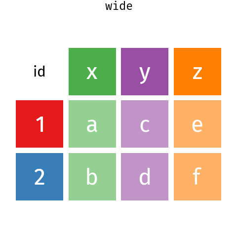

<style type="text/css">
.remark-slide-content {
    font-size: 24px;
    padding: 1em 4em 1em 4em;
}
</style>

```{r setup, echo=FALSE, message=FALSE}
knitr::opts_chunk$set(echo = TRUE, warning = FALSE, error = TRUE)
library("tidyverse")
data(penguins, package = "palmerpenguins")
options(dplyr.print_min = 2, dplyr.print_max = 3)
```

```{r xaringanExtra-clipboard, echo=FALSE}
xaringanExtra::use_clipboard()
```

```{r share-again, echo = FALSE}
xaringanExtra::use_share_again()
```

# Data cleaning

- Critical
- Time consuming 
- Do in code for reproducibility
- Often not taught

```{r, echo = FALSE, fig.cap="Figure from [towards_AI](https://twitter.com/towards_AI/status/1332567246011555840?s=20)", fig.alt = "Meme showing cute puppy representing data used in tutorials and a weird dog representing data in the wild."}
knitr::include_graphics("figures/wild_data.jpg")
```


---
# Tidy data

    Happy families are all alike; every 
    unhappy family is unhappy in its own way    Tolstoy 
    
- Every column is a variable.
- Every row is an observation.
- Every cell is a single value.

```{r, echo = FALSE, fig.alt = "Representation of tidy data, showing variables in columns, observations in rows, and single values in each cell. Source: R for Data Science", out.width="100%"}
knitr::include_graphics("figures/tidy1.png")
```

.footnote[[Wickham (2014) Tidy data](https://vita.had.co.nz/papers/tidy-data.pdf)]

---
# Untidy data

``` {r tidy, echo=FALSE, message=FALSE}
table2 <- read_delim(file = "data/nottidy.csv", delim = ";")
knitr::kable(table2 |> select(1:5))
```

---
# The heart of your analysis pipeline

```{r tidy-heart, echo = FALSE, fig.alt = "Diagram showing tidy data at the heart of data analysis"}
library(DiagrammeR)
grViz("
      digraph circo {
      
      graph [layout = dot,  rankdir = TB]
      node [shape = circle, fontsize = 18, style = filled, fillcolor =  orange, fixedsize = FALSE, fontname = 'Palatino', label = '']
      a1 [shape = circle, fillcolor = purple]
      a2 [shape = doubleoctagon, fillcolor = darkgreen]
      a3 [shape = star]
      
      node [shape = egg, fontsize = 18, style = filled, fillcolor =  steelblue1, fixedsize = FALSE, fontname = 'Palatino']

      b [label = 'Tidy data', shape = box]
      c [label = 'Clean and tidy data', shape = box]

      d [label = 'Analysis']
      e [label = 'Visualisation']
      
      {a1, a2, a3}->b->c->{d, e}

      }
     ", height = 500)
```


---
# Pipes

Analysis:

 - With penguins data
 - Drop rows with NA sex
 - find mean bill length per species per sex

First solution

```{r}
summarise(
  group_by(drop_na(penguins, sex), species, sex), 
  bill_length_mean = mean(bill_length_mm),
  .groups = "drop")
```

---
Second solution

```{r}
p <- drop_na(penguins, sex)
p <- group_by(p, species, sex)
p <- summarise(p,
         bill_length_mean = mean(bill_length_mm),
        .groups = "drop")
```

Third solution

```{r}
p_1 <- drop_na(penguins, sex)
p_2 <- group_by(p_1, species, sex)
p_3 <- summarise(p_2,
         bill_length_mean = mean(bill_length_mm),
        .groups = "drop")
```

---
## pipe solution

```{r}
p <- penguins |> 
  drop_na(sex) |> 
  group_by(species, sex) |> 
  summarise(
    bill_length_mean = mean(bill_length_mm),
    .groups = "drop")
```

Pipe puts result of left hand side into first available argument on right hand side

- |> native R pipe (R >= 4.1)
- `%>%` `magrittr` pipe

---
# Reshaping data

Long data vs wide data

```{r, echo=FALSE, fig.alt = "Animation showing how pivot_longer converts wide data to long, and pivot_wider does the opposite."}

```


---

```{r echo= FALSE}
data(data = "mite", package = "vegan")
mites <- mite |> 
  select(1:4) |> 
  rowid_to_column(var = "sample") |> 
  slice(1:5)

options(dplyr.print_min = 10, dplyr.print_max = 12)
```

Wide data

```{r}
mites # part of vegan::mite
```

---
## pivot_longer()

```{r}
mites_long <- mites |> 
  pivot_longer(cols = Brachy:RARD, 
               names_to = "taxon", 
               values_to = "count")
mites_long
```

---
## pivot_wider()

```{r}
mites_wide <- mites_long |> 
  pivot_wider(names_from = "taxon", 
              values_from = "count")
mites_wide
```
```{r, echo=FALSE}
options(dplyr.print_min = 2, dplyr.print_max = 3)
```

---
# Key dplyr functions

- `select()`
- `filter()`
- `mutate()`
- `summarise()`
- `group_by()`

---
# Selecting columns  
`dplyr::select()`

```{r}
penguins |> 
  select(species, bill_length_mm)
```


```{r}
penguins |> 
  select(-bill_length_mm, -bill_depth_mm)
```

---
## Selecting adjacent columns

```{r}
penguins |> 
  select(bill_length_mm:body_mass_g)
```

```{r}
penguins |> 
  select(-(bill_length_mm:body_mass_g))
```


---
## Select helpers

`ends_with()`
```{r}
penguins |> 
  select(species, ends_with("mm"))
```
- `starts_with()`
- `contains()`
- `matches()` regular expressions

---
# Filtering rows 
`dplyr::filter()`

```{r}
penguins |> filter(species == "Gentoo")
```

One or more logical statements

- `==`
- `>=`
- `<`
- `!=`

---
## near()

Problem:

```{r}
sqrt(2) ^ 2 == 2
```

```{r}
sqrt(2) ^ 2 - 2
```


Solution:

```{r}
near(sqrt(2) ^ 2, 2)
```

---
## `%in%`

Problem

```{r}
penguins |> 
  filter(species == "Gentoo" | species == "Chinstrap")
```

- `|` OR

Solution

```{r}
penguins |> 
  filter(species %in% c("Gentoo", "Chinstrap"))
```

---
## `between()`

Problem

```{r}
penguins |> 
  filter(body_mass_g >= 2000, body_mass_g <= 3000)
```

Solution

```{r}
penguins |> 
  filter(between(body_mass_g, left = 2000, right = 3000))
```

---
## Partial string matches

Problem

Want to filter by partial text match

solution: `stringr` package

```{r}
penguins |> 
  filter(str_detect(species, "G"))
```

Regular expressions for more powerful matching.

---
# Mutating columns with mutate()

Make a new column or change an existing column

```{r}
penguins |> mutate(
  species = tolower(species),
  body_mass_kg = body_mass_g/1000,
  bill_ratio = bill_length_mm/bill_depth_mm
  )
```

---
## Useful functions for mutate

- mutate character columns with `stringr`, `glue`
- mutate factor columns with `forcats`
- mutate dates with `lubridate`

---
# Summarising data with summarise

```{r}
penguins |> 
  summarise(
    max_mass = max(body_mass_g, na.rm = TRUE),
    mean_bill_length = mean(bill_length_mm, na.rm = TRUE)
  )
```

Useful functions

- limits `min()` `max()`
- centre `mean()` `median()`
- spread `sd()`
- number `n()` `n_distinct()`

---
# Grouping data

```{r}
penguins |> 
  group_by(species, island)
```

Mutate and summarise now work per group


---
# Mutating grouped data

Analysis per group

```{r}
penguins |> 
  group_by(species) |> 
  mutate(bill_length_mean = mean(bill_length_mm, na.rm = TRUE),
         bill_length_centred = bill_length_mm - bill_length_mean)
```


---
# Summarising grouped data

Summary per group

```{r}
penguins |> 
  group_by(species) |> 
  summarise(
    max_mass = max(body_mass_g),
    mean_bill_length = mean(bill_length_mm),
   .groups = "drop"
  )
```


---
# Counting rows

```{r}
penguins |> 
  count(species, island, sex)

penguins |> 
  group_by(species, island, sex) |> 
  summarise(n = n(), .groups = "drop")
```

---
# Mutating joins

Merge two tibbles

```{r, echo = FALSE, fig.alt = "Animation showing how left_join merges two data frames by a common variable."}
knitr::include_graphics("figures/left-join.gif")
```

---
## left_join()

.pull-left[
```{r}
band_members
band_instruments
```
]

.pull_right[
```{r}
band_members %>% 
  left_join(band_instruments, by = "name")
```

## Other joins

- `inner_join()`
- `full_join()`

]

---
# Filtering joins

```{r}
#semi join
band_members %>% 
  semi_join(band_instruments, by = "name")

#anti join
band_members %>% 
  anti_join(band_instruments, by = "name")
```


---
# Tidy code

<blockquote class="twitter-tweet" data-lang="en" width = "550"><p lang="en" dir="ltr">The only way to write good code is to write tons of shitty code first. Feeling shame about bad code stops you from getting to good code</p>&mdash; Hadley Wickham (@hadleywickham) <a href="https://twitter.com/hadleywickham/status/589068687669243905">17 April 2015</a></blockquote>
<script async src="//platform.twitter.com/widgets.js" charset="utf-8"></script>

---
# Why?

 - Makes code easier to read
 - Makes code easier to debug

Make your own style - but be consistent

---
# Naming Things

>    “There are only two hard things in Computer Science: cache invalidation and naming things.”

>    — Phil Karlton

 - Names can contain letter numbers "_"" and "."
 - Names must begin with a letter or "."
 - Avoid using names of existing functions - confusing
 - Make names concise yet meaningful
 - Reserved words include TRUE, for, if

---
# White-space is free! 

Place spaces

- around infix operators (`|>`, `+`, `-`, `<-`, ) 
- around `=` in function calls
- after commas not before
- but `1:10` and `dplyr::select()`

### Good
```{r, eval = FALSE}
average <- mean(feet / 12 + inches, na.rm = TRUE)
```
### Bad
```{r, eval = FALSE}
average<-mean(feet/12+inches,na.rm=TRUE)
```

---
# Split long commands over multiple lines

```{r, eval = FALSE}
penguins |> 
  group_by(species) |> 
  summarise(
    max_mass = max(body_mass_g),
    mean_bill_length = mean(bill_length_mm),
   .groups = "drop"
  )
```

---
# Indentation makes code more readable

### Good
```{r, eval = FALSE}
positive <- function(x) {
  if (is.null(dim(x))) {
    x[x > 0]
  } else{
    x[, colSums(x) > 0, drop  = FALSE]
  }
}
```

### Bad
```{r, eval = FALSE}
positive <- function(x){
if(is.null(dim(x)))
{x[x >0]} 
else{
x[, colSums(x) > 0, drop  = FALSE]
}}
```

---
# Assignment

Use <-, not =, for assignment.

### Good
```{r, eval = FALSE}
x <- 5
```
### Bad
```{r, eval = FALSE}
x = 5
```

---
# Comments

Use # to start comments.

Help you and others to understand what you did

Comments should explain the why, not the what.

Use comments for navigation
```{r, eval = FALSE}
#### Load data ####
...
#### Plot data ####
...
```

---
# Split analyses over multiple files

Long scripts become difficult to navigate

Fix by moving parts of the code into different files

For example: 

 - data import code to "loadData.R"
 - functions to "functions.R"

Import with  
```{r, eval = FALSE}
source("loadData.R")
source("functions.R")
```

---
# Don't repeat yourself

Repeated code is hard to maintain

Make repeated code into functions.

```{r, eval = FALSE}
my_fun <- function(arg1) {arg1 ^ 2}
my_fun(7)
```
Single place to maintain

---
# Further reading

.pull-left[
Wickham and Grolemund (2017) [R for Data Science](https://r4ds.had.co.nz/)

Wickham, H. Style Guide _Advanced R_
[http://adv-r.had.co.nz/Style.html](http://adv-r.had.co.nz/Style.html)
]
.pull-right[
```{r, echo = FALSE, fig.alt = "Front page of the R for Data Science book with a kākāpō."}
knitr::include_graphics("figures/r4ds.png")
```
]
